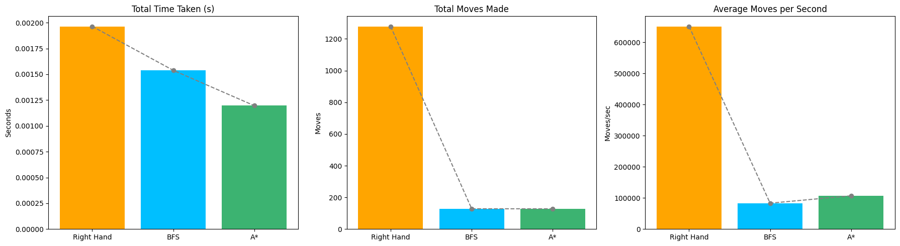

# Assignment 2 Maze Explorer Game
## DSAI3202 - Parallel and Distributed Computing
## By: Dela Cruz, Joy Anne 60301959

A simple maze exploration game built with Pygame where you can either manually navigate through a maze or watch an automated solver find its way to the exit.

### Automated maze explorer overview
The algorithm used by `explorer.py` is the right-hand rule algorithm with backtracking. It is a pathfinding method on mazes that are fully enclosed by walls. The explorer begins by keeping his right side close to the wall and continues throughout the maze keeping his right side on the wall/ This ensures that the explorer finds the target if it exists and there is a valid path. During implementation, the explorer always attempts to turn right. If there is no right turn, it moves forward. If it can't go forward, it goes left. If there are no other options, it moves backwards/turns around. The explorer repeats this until it finds the target. 

``` python3
return (self.move_history[0] == self.move_history[1] == self.move_history[2])
``` 
This particular explorer keeps a memory of the last three positions it was in. If those last three positions are the same then the explorer is deemed stuck. If it's stuck, it backtracks by trying to find a path back to a position with choices to move. If it doesn't find a valid backtrack, then it just turns around. If it is not stuck, it does the normal algorithm where it tries to move right, forward, left, or backwards in that priority.

``` python3
def print_statistics(self, time_taken: float):
   """Print detailed statistics about the exploration."""
   print("\n=== Maze Exploration Statistics ===")
   print(f"Total time taken: {time_taken:.10f} seconds")
   print(f"Total moves made: {len(self.moves)}")
   print(f"Number of backtrack operations: {self.backtrack_count}")
   print(f"Average moves per second: {len(self.moves)/time_taken:.2f}")
``` 
To keep track of the performance of the explorer, some statistics are printed out about the exploration. The total time taken indicates how long it took the explorer to find a valid path from the starting point to the target in seconds. The total moves made is the count of steps the explorer took to find that path; this includes all natural moves and backtracking moves. The number of backtrack operations are also counted and displayed. Among multiple runs on different maze types I've noticed that the backtracking operation is never used; this is likely because of the strict conditions to be in the stuck position and the algorithm's natural decision for the next step. The number of moves is divided by the total time taken to give us the average move per second, which can be used to compare how much the algorithm thinks/takes before proceeding to the next move on average

I have actually tried this technique myself on grass mazes. We ended up exploring half of the maze but the method eventually got us out. It is not the most efficient method but it does guarantee the way out.


### Multiple explores with MPI4Py 
At first, I ran multiple explorers on multiple machines using MPY4Py. I ran four explorers on two machines to get the results of each explorers. The machines communicated using gather() to receive all the data from other ranks. I chose this as I've already used send and receive on the other assignment.

``` bash
=== Summary of Results ===
Rank 0, Time = 0.0017559528s, Moves = 1279, Backtracks = 0
Rank 1, Time = 0.0014426708s, Moves = 1279, Backtracks = 0
Rank 2, Time = 0.0018639565s, Moves = 1279, Backtracks = 0
Rank 3, Time = 0.0015981197s, Moves = 1279, Backtracks = 0

Fastest explorer: Rank 1 Time =  0.0014426708s, Moves = 1279, Backtracks = 0
```

All the explorers had similar results, only varying the total time spent by fractions of a second. When looking at the code, the all explorers are following the exact same algorithm on the exact same static maze map, therefore they are arriving at the same results and the differences in time is not significant.

### Performance of different maze explorers
As all of the explorers had similar results, I tried to modify the explorer while still keeping the main algorithm of the right-hand rule the same. I did this by exploring changes and backtracking. On the previous runs, backtracking has never occurred due to the strict condition to trigger the is_stuck function therefore, I tried different variations on defining the triggering function. 

I kept the original stuck condition the same—where is stuck will return true if the last three moves are the same; I added a variation of this, only needing the same position for two consecutive moves. Another condition I added is if the Explorer goes back and forth on the same two positions. The last condition I made is if the Explorer ends up in the same position after five moves.

``` bash
=== Summary of Results ===
Rank 0, is_stuck definition 0, Time = 0.0018565655s, Moves = 1279, Backtracks = 0
Rank 1, is_stuck definition 1, Time = 0.0011942387s, Moves = 1279, Backtracks = 0
Rank 2, is_stuck definition 2, Time = 0.0018227100s, Moves = 1279, Backtracks = 0
Rank 3, is_stuck definition 3, Time = 0.0012023449s, Moves = 1279, Backtracks = 0
Rank 4, is_stuck definition 0, Time = 0.0017056465s, Moves = 1279, Backtracks = 0
Rank 5, is_stuck definition 1, Time = 0.0012824535s, Moves = 1279, Backtracks = 0
Rank 6, is_stuck definition 2, Time = 0.0018355846s, Moves = 1279, Backtracks = 0
Rank 7, is_stuck definition 3, Time = 0.0012183189s, Moves = 1279, Backtracks = 0

Fastest run: Rank 1 Time =  0.0011942387s, Moves = 1279, Backtracks = 0
```

Even after defining these different stuck conditions and applying them on different ranks, the results still stayed the same. This may be bacause all the wall are connected to one another.

### Implement enhancements
The current explorer can find a path from beginning to end, but it does not do it very efficiently, nor does it optimize the path to be shorter. Even with modifications to the stuck-condition, the explorer still does not find a shorter path. Applying other state search algorithms can help the explorer find shorter routes and applying heuristics may speed up and optimize the process.

Breast First Search (BFS) can find the shortest path in unweighted graphs like this grid-structured maze. It always finds the shortest path if it exists unlike the right-hand method where it only finds a signular path—not necessarily the shortest path. It works as First In First Out (FIFO); it does this by exploring all adjacent nodes then for each of those neighboring nodes, all their adjacent nodes are explored. 

``` python3
class bfs_explorer(Explorer):
    def solve(self) -> Tuple[float, List[Tuple[int, int]]]:
      """
        Solve the maze using the Breadth-First Search (BFS) algorithm.

        BFS explores the maze level by level, ensuring the shortest path is found 
        by visiting the nearest unvisited positions first. It uses a queue to track 
        unexplored frontier positions and builds the path incrementally.

        Returns:
            Tuple[float, List[Tuple[int, int]]]: 
                - The total time taken to solve the maze.
                - The list of positions (x, y) representing the path from start to goal.
        """
        self.start_time = time.time()
        start = self.maze.start_pos
        goal = self.maze.end_pos

        # Implementing FIFO system
        queue = deque()
        queue.append((start, []))
        visited = set()

        while queue:
            # exploring first in
            current, path = queue.popleft()

            # skipping already explored positions
            if current in visited:
                continue
            visited.add(current)

            self.x, self.y = current
            self.moves = path + [current]

            if self.visualize:
                self.draw_state()

            if current == goal:
                break
            
            # checking all four directions 
            for dx, dy in [(0, 1), (0, -1), (1, 0), (-1, 0)]:
                nx, ny = current[0] + dx, current[1] + dy
                if (0 <= nx < self.maze.width and 
                    0 <= ny < self.maze.height and # if the position is in the maze
                    self.maze.grid[ny][nx] == 0 and # if a free space
                    (nx, ny) not in visited):
                    # adding the new positions in queue
                    queue.append(((nx, ny), self.moves))

        self.end_time = time.time()
        time_taken = self.end_time - self.start_time

        if self.visualize:
            pygame.time.wait(2000)
            pygame.quit()

        self.print_statistics(time_taken)
        return time_taken, self.moves
``` 

A* is another state search algorithm but in addition to that: A* uses heuristics. Heuristic is an estimation of the remaining cost—in our case, it's the estimated remaining Manhattan distance from the current position to the goal, assuming there are no walls/obstacles. This method also finds the shortest path, but is usually faster given a good heuristic function. Unlike BFS that implements a queue, A* implements a priority queue.


``` python3
class a_star_explorer(Explorer):
    def heuristic(self, a: Tuple[int, int], b: Tuple[int, int]) -> int:
        """
        Estimate the cost from node `a` to node `b` using Manhattan distance.

        This heuristic is admissible for grid-based mazes without diagonal movement,
        ensuring optimality of the A* algorithm.

        Args:
            a (Tuple[int, int]): The current node (x, y).
            b (Tuple[int, int]): The goal node (x, y).

        Returns:
            int: The estimated cost to reach `b` from `a`.
        """
         # Manhattan Distance because the distances grid only
        return abs(a[0] - b[0]) + abs(a[1] - b[1])

    def solve(self) -> Tuple[float, List[Tuple[int, int]]]:
        """
        Solve the maze using the A* pathfinding algorithm.

        A* searches for the optimal path from the maze's start to end position by 
        evaluating both the actual path cost so far (g) and a heuristic estimate 
        to the goal (h). It uses a priority queue to explore the most promising 
        paths first.

        Returns:
            Tuple[float, List[Tuple[int, int]]]: 
                - The total time taken to solve the maze.
                - The list of positions (x, y) representing the path from start to goal.
        """
        self.start_time = time.time()
        start = self.maze.start_pos
        goal = self.maze.end_pos

        open_set = []
        heappush(open_set, (self.heuristic(start, goal), 0, start, []))
        visited = set()

        while open_set:
            # choosing the lowest total estimated cost
            est_total, cost_so_far, current, path = heappop(open_set)
            if current in visited:
                continue
            # skipping alre
            # ady explored positions
            visited.add(current)

            self.x, self.y = current
            self.moves = path + [current]

            if self.visualize:
                self.draw_state()

            if current == goal:
                break

            # checking all four directions 
            for dx, dy in [(0, 1), (0, -1), (1, 0), (-1, 0)]:
                nx, ny = current[0] + dx, current[1] + dy
                if (0 <= nx < self.maze.width and
                    0 <= ny < self.maze.height and  # if the position is in the maze
                    self.maze.grid[ny][nx] == 0 and # if a free space
                    (nx, ny) not in visited):

                    # update g(x)
                    new_cost = cost_so_far + 1 

                    # f(x) = g(x) + h(x)
                    heappush(open_set, (
                        new_cost + self.heuristic((nx, ny), goal), 
                        new_cost,
                        (nx, ny),
                        self.moves
                    ))

        self.end_time = time.time()
        time_taken = self.end_time - self.start_time

        if self.visualize:
            pygame.time.wait(2000)
            pygame.quit()

        self.print_statistics(time_taken)
        return time_taken, self.moves
```

### Performance of enhanced explorer
After implementing the two new explorer algorithms, all three explorers were run on the static maze map, and the following results are given. 
``` bash
=== Maze Exploration Statistics ===
Total time taken: 0.0019645691 seconds
Total moves made: 1279
Number of backtrack operations: 0
Average moves per second: 651033.35
==================================

> Maze solved in 0.00 seconds
> Right Hand Number of moves: 1279

=== Maze Exploration Statistics ===
Total time taken: 0.0015385151 seconds
Total moves made: 128
Number of backtrack operations: 0
Average moves per second: 83197.10
==================================

> Maze solved in 0.00 seconds
> BFS Number of moves: 128

=== Maze Exploration Statistics ===
Total time taken: 0.0011959076 seconds
Total moves made: 128
Number of backtrack operations: 0
Average moves per second: 107031.68
==================================

> Maze solved in 0.00 seconds
> A* Number of moves: 128
```


The enhanced explorers that utilized state search algorithms did find the shortest path, staying true to their algorithm properties. They took less time to find the solution than the right hand—with A* being the fastest. A* was also able to explore more moves per second than BFS, although the right-hand rule still moved the most per second, despite being slower over all because of how many moves it made. 


The enhanced methods were faster, but per move they were more computationally expensive as they had to calculate the distance, and in the case for A-Star, the heuristic cost had to be calculated as well. I would argue this is a good tradeoff as there were significantly less moves taken by these two algorithms. 

The right hand method have very minimal memory use however BFS and especially A* used more memory. This could be a problem if the maze was much bigger, potentially needing better RAMs which are expensive.

### Bonus points
The following bonus points were (potentially) achieved:
   * Solve the static maze in 130 moves or less to get 100% in your assignment.
   * Finding a solution with no backtrack operations
   * Least number of moves 
   * Fastest solver to get top 10% routes (number of moves)